# Tinder for Chihuahua — use case

> Aplikacja, której użytkownik jest dichromatem o ostrości wzroku 20/75, a jego
> urządzeniem wejściowym jest mokry nos.

Lokalna PWA na iPhone 13 Pro Max dla dwóch chihuahua: **Karmel** (5 lat) i **Auri**
(12 lat, jego matki). Szukają partnera, który nie jest członkiem rodziny.

| | |
|---|---|
| **Rola** | Lead designer — research, IA, design system, UI |
| **Zakres** | 9 ekranów w dwóch skalach, CIG i tokeny, protokół testu |
| **Rama** | Speculative design — zakładamy, że psy obsłużą ekran |
| **Stack** | PWA · Vite + React + TS · Tailwind · bez backendu |
| **Status** | Design zamknięty poza gestem wejścia w tryb ludzki |
| **Data** | 8 września 2026 |

## Jak czytać ten katalog

Panele w [`wall/`](wall/) są **numerowane i mają być czytane po kolei** — opowiadają
projekt w tej kolejności, w której powstawał: najpierw kto jest użytkownikiem, potem co z
tego wynika dla interfejsu, a na końcu ekrany. Każdy rozdział poniżej mówi trzy rzeczy:
**co to jest**, **dlaczego powstało** i **na co patrzeć**.

Jeśli masz czas na jedną rzecz, otwórz rozdział 04 — journey pokazuje jedyną naprawdę
nietypową cechę tego produktu: cztery z jedenastu kroków dzieją się poza aplikacją.

## Teza

**Jeden ekran, dwóch użytkowników.** Pies przesuwa kartę i wyraża preferencję wobec tego,
co widzi. Człowiek ją czyta i decyduje o realnym spotkaniu. Aplikacja nie kojarzy psów —
zbiera sygnał i przekazuje go swatce. Wyjściem produktu jest ranking preferencji, nie
„match".

---

## Rozdziały

### 00 · Cover
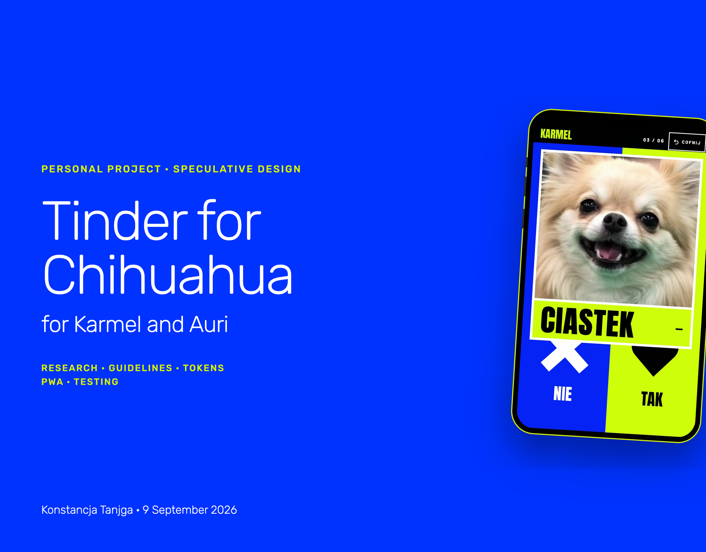
`00-cover.png` — 1920×1502 · **gotowe**
**Co to jest:** karta projektu w formacie okladek portfolio: plaskie tlo blue, typografia
po lewej, iPhone schodzacy z prawej krawedzi. Na ekranie telefonu jest prawdziwa klatka z
nagrania, nie artboard.
**Dlaczego:** pozostale use case'y maja tam laptopa ze zrzutem. Ten produkt nie istnieje na
desktopie, wiec urzadzenie musialo sie zmienic, a format nie.
**Na co patrzec:** na pierscien acid wokol obudowy. Kazda barwa palety wystepuje takze w
aplikacji, wiec bez niego strefa NIE zlewa sie z tlem i telefon traci krawedz.

### 01 · Problem i brief
`wall/ch01-brief.png` · **do zrobienia**
**Co to jest:** obietnica dana dwóm psom i to, co z niej wynika jako zakres produktu.
**Dlaczego:** bez tego reszta wygląda na żart, a nie na projekt z ograniczeniami.
**Na co patrzeć:** na rozstrzygnięcie, że v1 jest jednostronne i lokalne — to omija problem
cold startu, który zabił konkurencję.

### 02 · Research: psi odbiorca
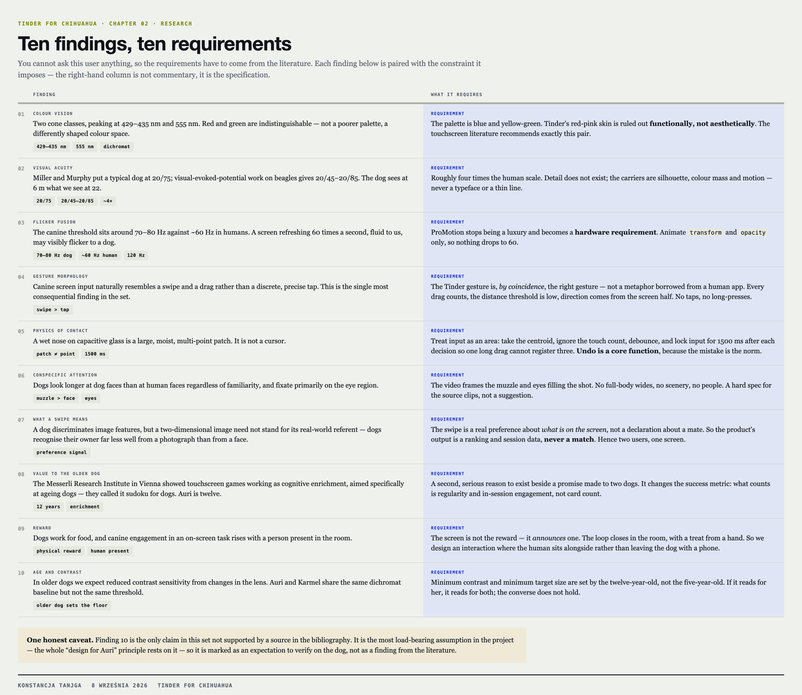
`wall/ch02-research.png` · **gotowe**
**Co to jest:** dziesięć ustaleń z literatury, każde sparowane z wymaganiem projektowym.
**Dlaczego:** użytkownika nie da się zapytać, więc wymagania muszą przyjść z badań.
**Na co patrzeć:** 429 i 555 nm (paleta), 20/75 (skala ×4), 70–80 Hz (dlaczego 120 Hz to
wymaganie), oraz to, że psi input z natury przypomina swipe, a nie tap.

### 03 · Persony
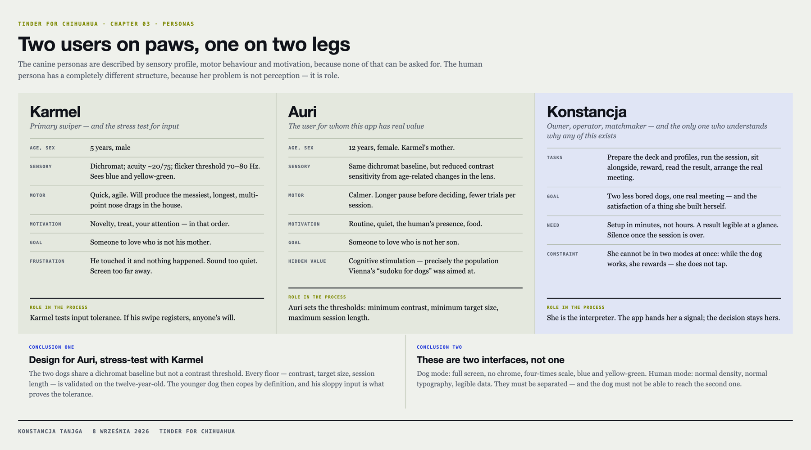
`wall/ch03-personas.png` · **gotowe**
**Co to jest:** dwie persony psie opisane profilem sensorycznym i motoryką, plus persona
ludzka opisana rolą.
**Dlaczego:** Karmel i Auri mają tę samą bazę dichromata, ale nie ten sam próg kontrastu.
**Na co patrzeć:** na wniosek „projektujemy dla Auri, testujemy Karmelem".

### 04 · User journey: sesja psa
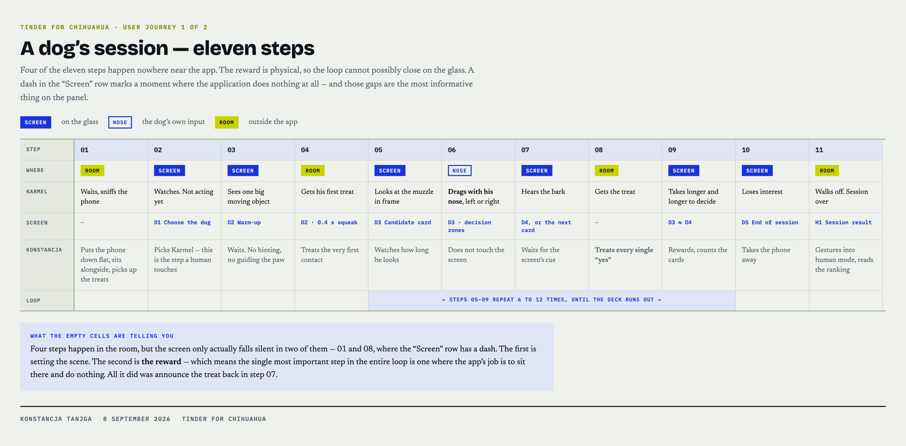
`wall/ch04-journey-sesja-psa.png` · **gotowe**
**Co to jest:** jedenaście kroków sesji w swimlane, z oznaczeniem, gdzie każdy się dzieje.
**Dlaczego:** nagroda jest fizyczna, więc pętla nie domyka się na ekranie — a to zmienia
architekturę produktu, nie tylko copy.
**Na co patrzeć:** na dwie kreski w wierszu „Ekran". Druga z nich, w kroku 08, to moment
nagrody — najważniejszy krok pętli dzieje się wtedy, gdy aplikacja nie robi nic.

### 05 · User journey: swatka
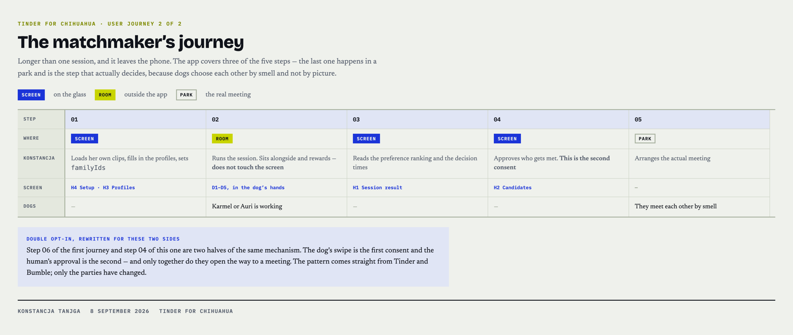
`wall/ch05-journey-swatka.png` · **gotowe**
**Co to jest:** pięć kroków journeya człowieka, od setupu do spotkania w parku.
**Dlaczego:** pokazuje, że wyjściem aplikacji nie jest match, a ranking preferencji.
**Na co patrzeć:** na krok 04 — zatwierdzenie człowieka jest drugą połową double opt-in
przepisanego z Tindera i Bumble, tylko strony się zmieniły.

### 06 · Service blueprint
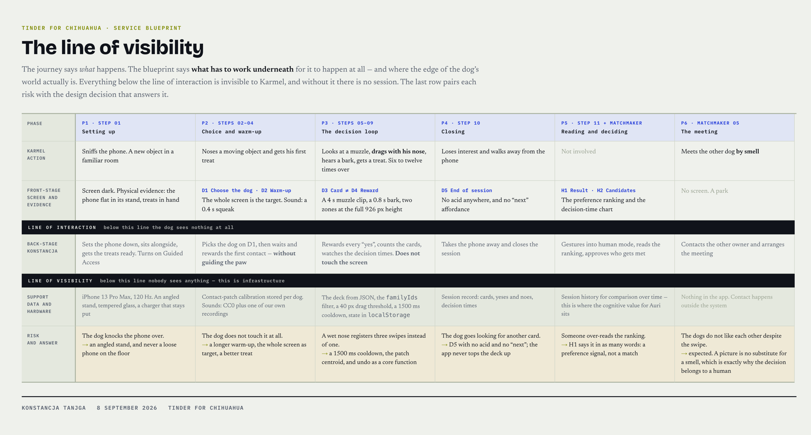
`wall/ch06-blueprint.png` · **gotowe**
**Co to jest:** front-stage kontra back-stage, z linią interakcji, linią widoczności i
warstwą ryzyk.
**Dlaczego:** journey mówi, co się dzieje; blueprint mówi, co musi zadziałać pod spodem,
żeby to się stało.
**Na co patrzeć:** na wiersz ryzyk — mokry nos rejestrujący trzy swipe'y zamiast jednego
jest powodem, dla którego cooldown wynosi 1500 ms, a undo jest funkcją rdzeniową.

### 07 · Benchmark
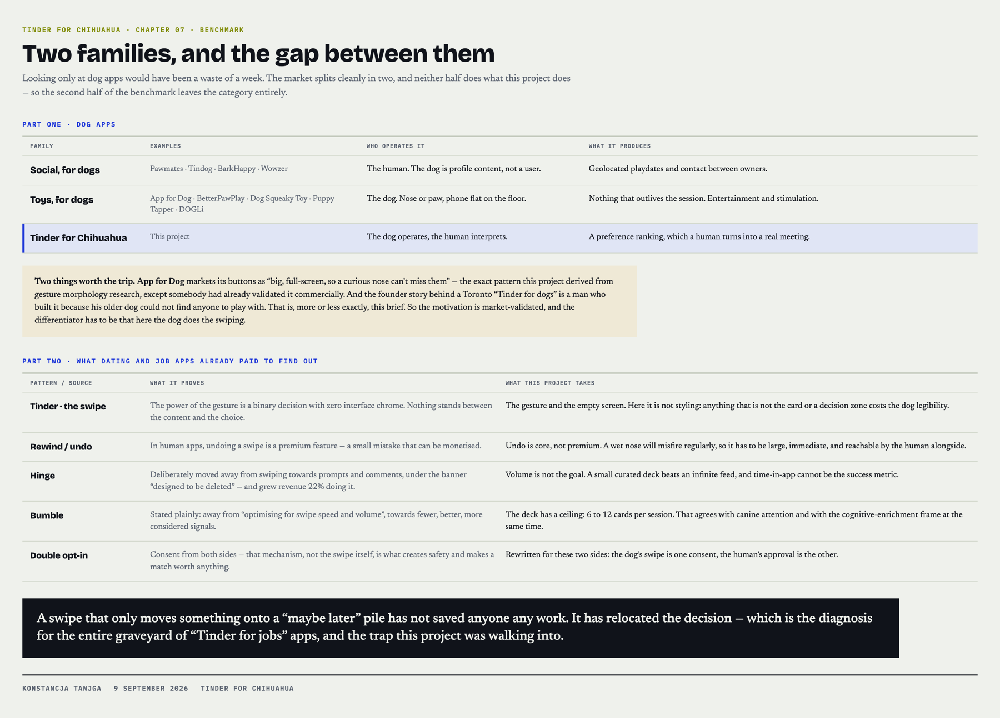
`wall/ch07-benchmark.png` · **gotowe**
**Co to jest:** psie apki w dwóch rodzinach plus wnioski z apek randkowych i rekrutacyjnych.
**Dlaczego:** wzorzec talii kart przeszedł w tych kategoriach pełny cykl życia, więc mamy
darmowy dostęp do ich porażek.
**Na co patrzeć:** na martwe „Tindery do pracy" — swipe, który tylko odkłada coś na stos
„może później", nie oszczędza niczego.

### 08 · Kierunki wizualne
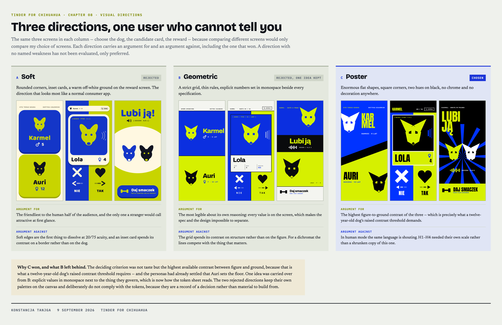
`wall/ch08-kierunki.png` · **gotowe**
**Co to jest:** trzy kierunki tych samych ekranów, z argumentem za i przeciw przy każdym.
**Dlaczego:** kierunek trzeba wybrać przed budową design systemu, a nie po.
**Na co patrzeć:** na to, że wybrany kierunek też ma wadę i jest ona nazwana.

### 09 · Canine Interface Guidelines
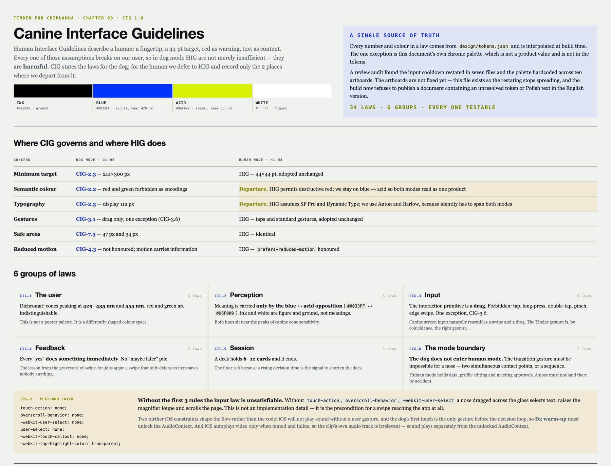
`wall/ch09-cig.png` · **gotowe**
**Co to jest:** dwadzieścia dziewięć numerowanych praw interfejsu dla psa w sześciu grupach,
plus warstwa platformowa PWA na iOS i checklista zgodności. Generowane z
`design/tokens.json`, więc ani jedna liczba nie jest wpisana ręcznie.
**Dokument jest po angielsku** — `design/cig.html` — bo to specyfikacja
przeznaczona do dokumentacji; wersja robocza po polsku leży w
`design/cig.pl.html`. Oba pliki wychodzą z jednego generatora, więc
nie mogą się rozjechać.
**Dlaczego:** Human Interface Guidelines opisują człowieka — palec, 44 pt celu, czerwień jako
ostrzeżenie, tekst jako treść. Każde z tych założeń pęka na dichromacie o ostrości 20/75,
którego urządzeniem wejściowym jest nos. W trybie psim HIG nie są niewystarczające, są
szkodliwe, więc własne wytyczne to konieczność, nie ambicja.
**Na co patrzeć:** na tabelę podziału odpowiedzialności — CIG rządzi trybem psim, HIG
ludzkim, a dla H1–H4 nie przepisujemy HIG, tylko notujemy trzy odstępstwa. I na warstwę
platformową: bez `touch-action: none` swipe nigdy nie dotrze do aplikacji.

### 10 · Ekrany trybu psiego
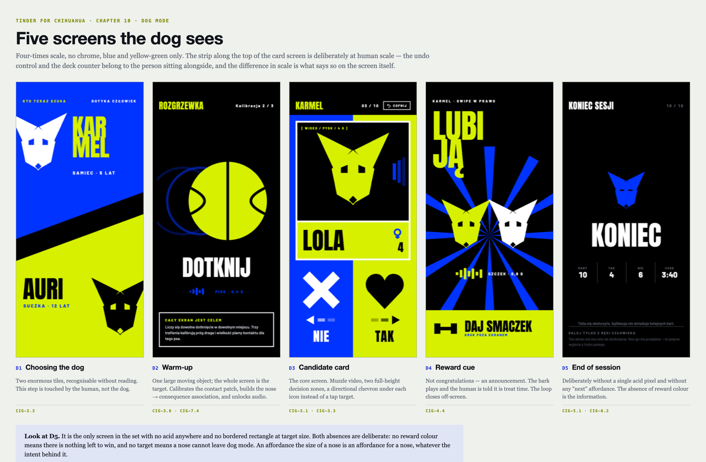
`wall/ch10-dog-mode.png` · **gotowe**
**Co to jest:** D1–D5 w skali ×4, bez chrome.
**Dlaczego:** to jedyna część, którą widzi pies.
**Na co patrzeć:** na strzałkę pod ikoną zamiast celu do stuknięcia, i na D5, w którym nie
ma ani jednego piksela acid.

### 11 · Ekrany trybu ludzkiego
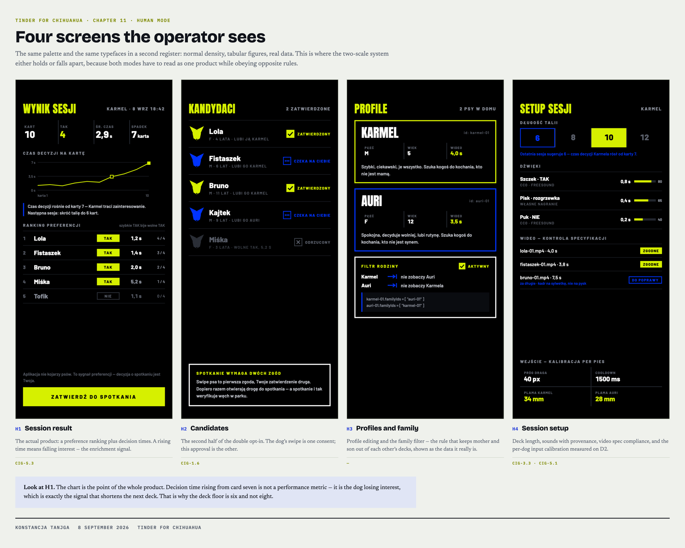
`wall/ch11-human-mode.png` · **gotowe**
**Co to jest:** H1–H4 w normalnej gęstości.
**Dlaczego:** dopiero zestawienie obu trybów pokazuje, czy system dwóch skal się trzyma.
**Na co patrzeć:** na H1 — ranking i wykres czasu decyzji. Rosnący czas to spadające
zainteresowanie.

### 12 · Plan testów z psami
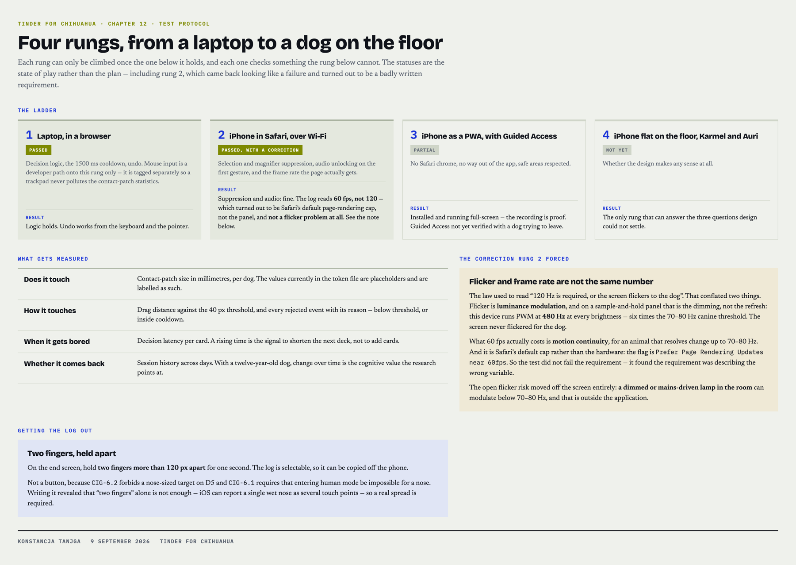
`wall/ch12-test.png` · **gotowe**
**Co to jest:** co mierzymy, ile sesji, kiedy uznajemy, że działa.
**Dlaczego:** bez tego „projektujemy dla Auri" jest hasłem, nie metodą.
**Na co patrzeć:** na metryki — czy dotyka, jak dotyka, po ilu kartach się nudzi, czy wraca
następnego dnia.

---

## Materiały źródłowe

Ścieżki, nie linki — GitHub pokazuje pliki `.html` jako surowy kod, więc linkowanie ich
wprowadzałoby w błąd. Do przeglądania służą panele PNG powyżej.

- `design/foundation.html` — fundament projektowy: research,
  benchmark, persony, journey, deliverables
- `design/journey.html` — oba journeye jako swimlane
- `design/blueprint.html` — service blueprint
- `design/cig.html` — Canine Interface Guidelines (EN), generowane z tokenów
- `design/cig.pl.html` — CIG po polsku, z tego samego generatora
- `design/tokens.json` — jedyne źródło prawdy dla liczb i barw
- `design/canvas/` — pliki źródłowe ekranów (`.dc.html`) i canvas
- `design/exports/` — źródła paneli PNG
- `CLAUDE.md` — zasady projektu i design system w formie tekstowej

---

## Źródła

Bibliografia, nie przypisy. Prace naukowe są **nazwane, a nie linkowane** — tytuł
i czasopismo to jest to, co pozwala pracę znaleźć. Źródła sieciowe są linkowane,
bo URL to wszystko, co mają.

Pełna lista z opisami leży w [`design/foundation.html`](../../design/foundation.html)
(rozdział „Na czym to stoi") oraz w
[opublikowanym use case](https://konstancja-tanjga.github.io/portfolio-site/work/tinder-for-chihuahua/#sources).

**Jedno twierdzenie jest świadomie niepodparte źródłem** i trzeba o tym wiedzieć,
bo na nim stoi cały podział person: że kontrast u Auri jest niższy **dlatego**, że
ma dwanaście lat. Zmiany soczewki z wiekiem u psów są opisane; zmierzony próg
kontrastu dla tej konkretnej dwunastolatki nie, i nie miałam czym go zmierzyć.
Więc „projektujemy dla Auri" jest argumentem z kierunku efektu, nie z liczby.
Sprawdza to szczebel 4 protokołu testu.

### Psi wzrok
- Neitz, Geist, Jacobs, *Color vision in the dog*, Visual Neuroscience 1989 — czopki 429 i 555 nm
- *In vivo electroretinographic differentiation of rod, short- and long/medium-wavelength cone responses in dogs* — to samo metodą ERG
- *Are dogs red–green colour blind?*, Royal Society Open Science
- *What do dogs see? A review of vision in dogs and implications for cognition research*, Psychonomic Bulletin & Review — ostrość 20/75 i próg migotania 70–80 Hz
- Coile i in., 1989 — psi próg fuzji migotania 80 Hz, streszczone w [przeglądzie o critical flicker fusion](https://www.sciencedirect.com/topics/immunology-and-microbiology/critical-flicker-fusion)
- *On the use of touchscreen-based behavioural and cognitive research with dogs* — morfologia psiego gestu, rekomendacja pary niebieski–żółty
- *How dogs scan familiar and inverted faces: an eye movement study*, Animal Cognition — fiksacja na oczach
- *Dogs recognize familiar faces from images*; *2D or Not 2D? An fMRI study of how dogs visually process objects*; *Familiarity with images affects how dogs process life-size video projections of humans*

### Starzenie się i sens tej aplikacji
- *Brain training for old dogs*, Vetmeduni Vienna / Messerli Research Institute
- *Utilising dog-computer interactions to provide mental stimulation in dogs especially during ageing*
- *Aging effects on discrimination learning, logical reasoning and memory in pet dogs*, GeroScience

### Ekrany, migotanie i platforma — korekta z rozdziału 12
- [PWM dimming in OLED displays](https://www.oled-info.com/pulse-width-modulation-pwm-oled-displays) — dlaczego prawie każdy OLED ściemnia w 240 albo 480 Hz i dlaczego to ta częstotliwość decyduje o migotaniu
- [DXOMARK, test ekranu iPhone 13 Pro Max](https://www.dxomark.com/apple-iphone-13-pro-max-display-test-retested/) — zmierzone 480,19 Hz przy 97,6% głębokości modulacji, przy każdej jasności, bez DC dimming
- [Flicker, the display affliction](https://www.dxomark.com/flicker-the-display-affliction/) — migotanie jako modulacja jasności, nie jako liczba klatek
- [Domyślne 60 fps w Safari i flaga, która to zdejmuje](https://www.macrumors.com/how-to/enable-smoother-120hz-browsing-in-safari/) oraz [WebKit bug 173434](https://bugs.webkit.org/show_bug.cgi?id=173434)
- [Zachowanie psów w schronisku pod świetlówkami kontra LED](https://www.sciencedirect.com/science/article/abs/pii/S016815912500190X) — dlaczego resztkowe ryzyko migotania siedzi w oświetleniu pokoju, nie w urządzeniu

### Produkty z benchmarku
- App for Dog — „duże, pełnoekranowe przyciski, żeby ciekawski nos nie mógł ich nie trafić"; BetterPawPlay — jedenaście gier na nos i łapę
- *Training senior dogs to play games on touch screens*, PetMD
- Pawmates i „Tinder for dogs", PawTracks; *Man makes „Tinder for dogs" after his senior pup couldn't find playmates*, Newsweek
- *Dating apps are swiping left on the features that made them* — Hinge, Bumble; *The Death of the Swipe*, urdesignmag
- *Where have all the „Tinders of the job market" gone?*, ToTalent; *Why swipe UX for jobs works (better than you'd think)*; Switch (app), Wikipedia

---

**Konstancja Tanjga** · 8 września 2026 · Tinder for Chihuahua
